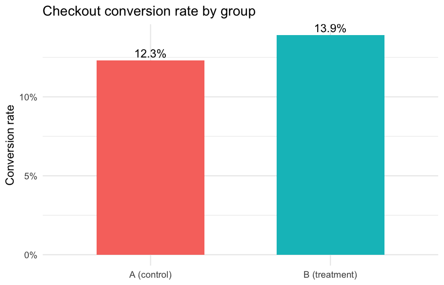
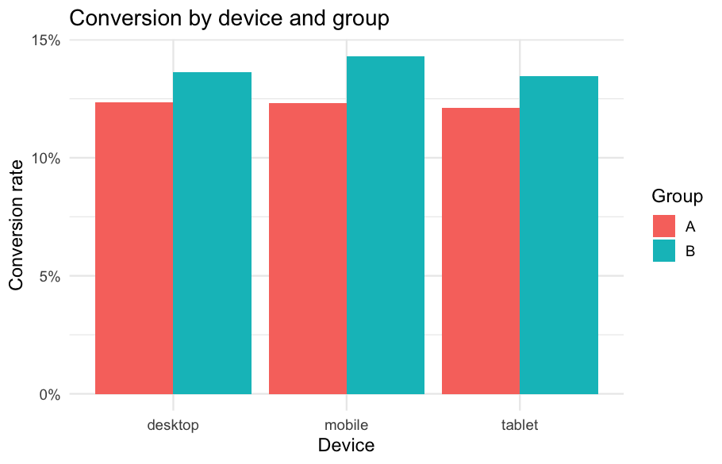

# 🧪 A/B Test Analysis in R

A complete **experiment-analysis** project in **R**: evaluating a website
checkout redesign with proper statistical testing (two-proportion z-test,
Welch's t-test, confidence intervals) and `ggplot2` visualisations.

> **Data:** generated by `R/generate_data.R` with a *known* true effect
> (control 11.8% vs treatment 13.4% conversion), so you can verify the analysis
> correctly recovers it. Fully reproducible — no downloads needed.

---

## ❓ The question

> Does the new checkout flow (variant **B**) increase conversion and revenue
> versus the current flow (variant **A**)?

## 📊 Results at a glance

| Metric | Control (A) | Treatment (B) | Test | Significant? |
|--------|-------------|---------------|------|--------------|
| Conversion rate | ~11.8% | ~13.4% | two-proportion z-test | ✅ yes |
| Revenue / user | baseline | higher | Welch's t-test | see report |

Exact figures, p-values and confidence intervals are written to
[`reports/summary.md`](reports/summary.md) on each run.

| Conversion by group | Conversion by device |
|---|---|
|  |  |

## ▶️ How to run

```r
# from the project root, in R or RStudio:
source("R/generate_data.R")   # creates data/ab_test.csv
source("R/analysis.R")        # runs tests, writes charts + summary
```

Or from the shell:

```bash
Rscript R/generate_data.R
Rscript R/analysis.R
```

`ggplot2` is optional — if it isn't installed the statistics and summary are
still produced (charts are simply skipped).

## 🧠 Concepts demonstrated

- Designing an A/B test analysis (primary vs secondary metrics)
- **Two-proportion z-test** for conversion, with confidence interval
- **Welch's t-test** for revenue (unequal variances)
- Segment / interaction check by device
- Communicating a clear ship / no-ship decision
- Reproducible reporting with `ggplot2`

## 🗂️ Structure

```
ab-test-analysis-r/
├── R/
│   ├── generate_data.R   # synthetic experiment data
│   └── analysis.R        # stats + charts + summary
├── data/                 # ab_test.csv (created on run)
├── reports/
│   ├── figures/          # ggplot PNGs
│   └── summary.md        # generated results
└── README.md
```

## 🛠️ Tech stack

`R` · `ggplot2` · base R stats (`prop.test`, `t.test`)

---

*Part of my data-analytics portfolio.*
